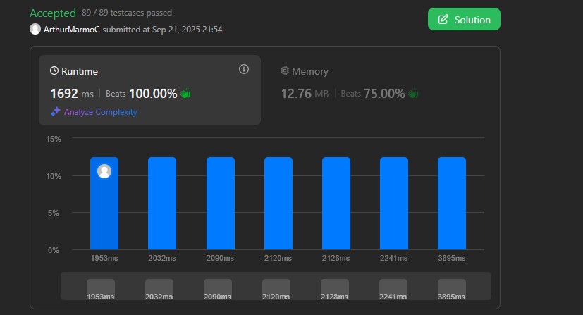
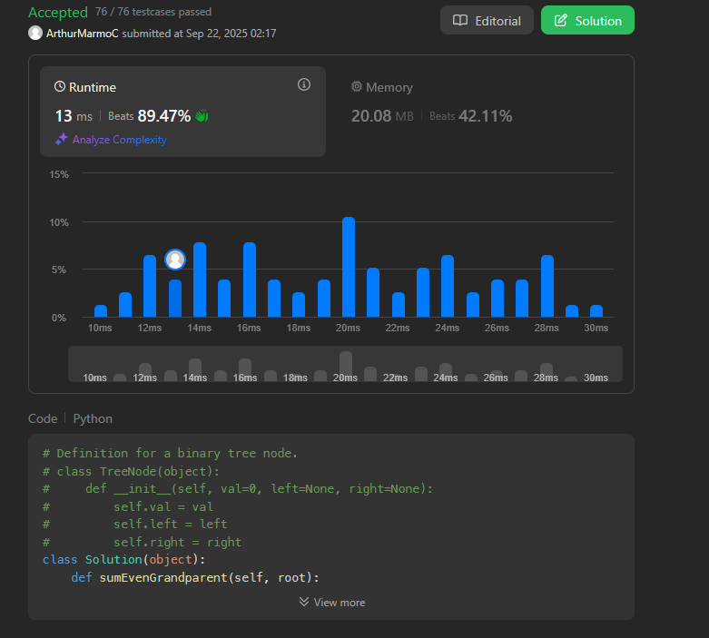
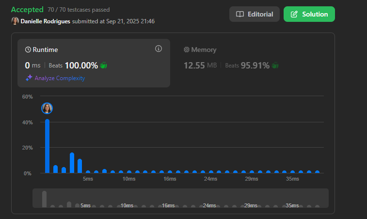

# Grafos 2 - Leetcode

**Conteúdo do Trabalho**: Grafos

## Alunos
|Matrícula | Aluno |
| -- | -- |
| 211043610  |  Arthur Marmo Cathalá |
| 211061574  |  Danielle Rodrigues Silva |

## Sobre 
Nesse projeto apresentamos soluções de exercícios do Leetcode usando Python.

## Screenshots das Submissões

### 1 - Difícil - [Shortest Cycle in a Graph](https://leetcode.com/problems/shortest-cycle-in-a-graph/description/)

### 2 - Média - [Sum of Nodes with Even-Valued Grandparent](https://leetcode.com/problems/sum-of-nodes-with-even-valued-grandparent/description/)

### 3 - Difícil - [Remove Max Number of Edges to Keep Graph Fully Traversable](https://leetcode.com/problems/remove-max-number-of-edges-to-keep-graph-fully-traversable/description/)

### 4 - Média - [Keys and Rooms](https://leetcode.com/problems/keys-and-rooms/description/)

## Vídeo de apresentação do Trabalho 2

